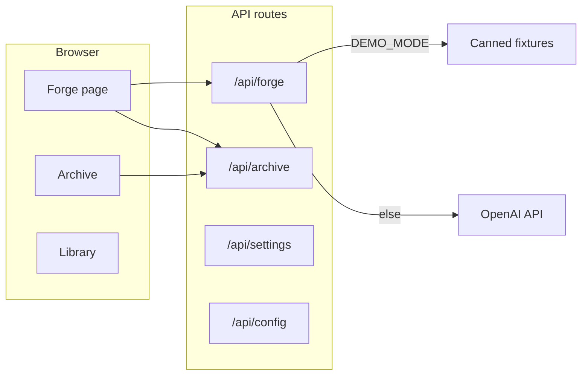

# Proof Forge

A personal project for turning **rough mathematical proof sketches** into **clearer, more structured proofs** — across analysis, algebra, discrete math, combinatorics, number theory, topology, and set theory — not just a single course.

It rewrites your sketch into numbered steps, surfaces weak justifications, and runs a **heuristic** verification pass (score + gap notes). It is **not** formal verification and **does not** guarantee correctness.

## Why I built this

I often had the right mathematical idea but not the cleanest written presentation. I wanted something that could help organize an argument into explicit steps, flag vague jumps (“clearly”, “obviously”, missing cases), and suggest alternative proof shapes when the draft felt shaky — more like a writing and structure assistant than a theorem prover.

## Limitations (read this)

- **Does not guarantee mathematical correctness** — the model can miss subtle errors or approve flawed sketches.
- **Not a substitute** for formal proof assistants (Lean, Coq, Isabelle, etc.).
- **Best used for** structure, clarity, revision prompts, and practice — always check the mathematics yourself.
- **Verification scores** are LLM judgments, not proofs; quality depends on context and how much detail you provide.
- **Demo mode** uses fixed sample outputs only; it does not validate your own mathematics.

## Architecture

| Layer | Technology |
|--------|------------|
| Frontend | Next.js (App Router), React 19, TypeScript, Tailwind CSS 4 |
| Backend | Next.js API routes (same repo) |
| LLM pipeline | classify + polish → verify → suggest (when verification fails) |
| Persistence | SQLite via Prisma (`ArchivedProof`, `UserSettings`) |
| Math rendering | KaTeX, `react-markdown`, remark-math |



## Features

- Multi-stage pipeline: proof-type classification, polished write-up, adversarial-style review, optional alternative strategies
- **Demo mode** (`DEMO_MODE=true`): “Run Demo” with canned examples (direct, contradiction, induction, ε–δ, combinatorial, set identity) — **no API key or credits**
- **Library**: curated axioms / definitions / theorems (static data), browsable by branch and type
- **Archive**: history of forged proofs with search, filters by domain and proof type, re-forge, duplicate-and-edit
- **Settings**: theme (light / system / dark), archive retention, API key
- **Examples** with topic, proof type, domain, difficulty, and common pitfall
- **Templates** for common proof outlines (direct, contradiction, induction, ε–δ, cases, …)
- Export polished output as **Markdown** or copy raw polished text
- LaTeX helpers and preview

## Prerequisites

### 1. Git

- **macOS:** Xcode Command Line Tools or [git-scm.com](https://git-scm.com/)
- **Windows:** [Git for Windows](https://git-scm.com/download/win)
- **Linux:** e.g. `sudo apt install git`

Check: `git --version`

### 2. Node.js 18+ (LTS 20 or 22 recommended)

- [nodejs.org](https://nodejs.org/) or **nvm** / **fnm** / **Volta**

Check:

```bash
node -v
npm -v
```

### 3. OpenAI API key (for live forging)

- Create a key at [platform.openai.com](https://platform.openai.com/)  
- **Not required** if you only use **demo mode** (see below)

Billing follows OpenAI’s pricing for **gpt-4o-mini**.

---

## Setup (step by step)

### Step 1 — Clone the repo

```bash
git clone https://github.com/akhiltalluri/Proof-Forge.git
cd Proof-Forge
```

### Step 2 — Install dependencies

```bash
npm install
```

`postinstall` runs `prisma generate` so the Prisma client is ready.

### Step 3 — Environment file

```bash
cp .env.example .env.local
```

Edit `.env.local`:

- **`OPENAI_API_KEY`** — optional if you paste the key only in the app Settings UI
- **`DEMO_MODE=true`** — enables server-side demo responses and the **Run Demo** control on Forge (no OpenAI calls for demos)

Never commit `.env.local`.

### Step 4 — Database (SQLite)

The schema lives in `prisma/schema.prisma`; the DB file is created under `data/` (gitignored) when you migrate:

```bash
npx prisma migrate dev
```

(If you already have migrations applied, this may report “already in sync”.)

### Step 5 — Run the dev server

```bash
npm run dev
```

Open **http://localhost:3000** (or the port shown in the terminal). The home route redirects to **`/forge`**.

### Step 6 — API key (if not using `.env.local`)

1. Open **Settings** in the nav, or use the Forge hint to set the key.  
2. The key is stored in **localStorage** in your browser and sent to **your** Next.js server only when you forge (not logged by the app by design).

### Step 7 — Try demo mode (optional)

1. Set `DEMO_MODE=true` in `.env.local` and restart `npm run dev`.  
2. On **Forge**, use the **Run Demo** dropdown — no OpenAI usage.

### Step 8 — Production build (optional)

```bash
npm run build
npm run start
```

---

## Troubleshooting

| Issue | What to try |
|--------|-------------|
| Errors loading pages / missing `.next` chunks | Stop dev server, delete `.next` and `node_modules/.cache`, run `npm run dev` again |
| Port 3000 in use | `npx next dev -p 3001` or free the port |
| OpenAI quota / rate limit | Check billing and limits on the OpenAI dashboard |
| Prisma / DB errors | Run `npx prisma migrate dev` from project root |

---

## Built with

Next.js 15 · React 19 · TypeScript · Tailwind CSS 4 · Prisma · SQLite · OpenAI API · KaTeX
